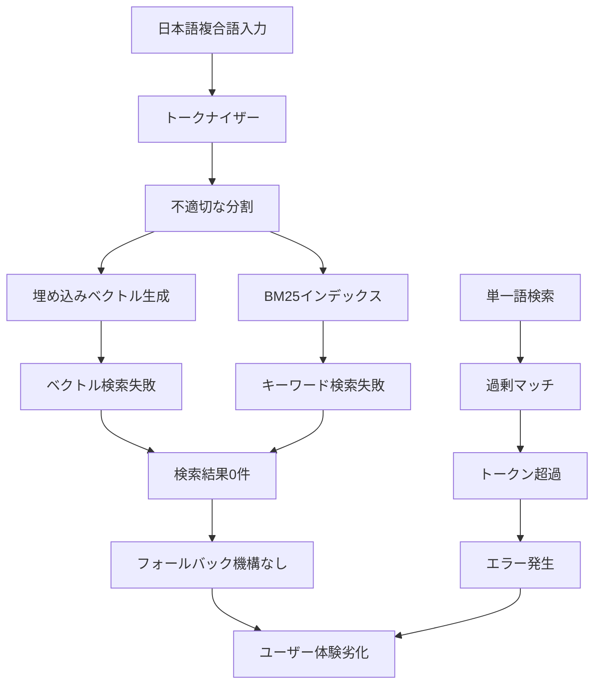
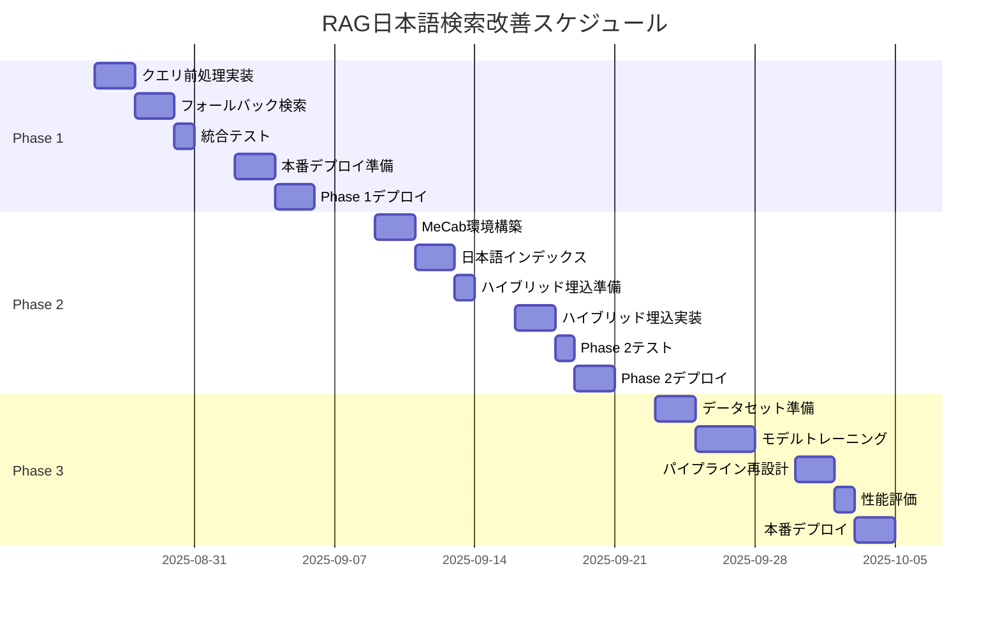

# RAG日本語検索改善 実装計画書

**バージョン**: 1.0.0  
**作成日**: 2025年8月24日  
**プロジェクト**: rag-second-brain MCP Server  
**計画期間**: 2025年8月26日 ～ 2025年10月4日（6週間）

## 目次

1. [プロジェクト概要](#プロジェクト概要)
2. [問題の根本原因分析](#問題の根本原因分析)
3. [現状の問題と解決目標](#現状の問題と解決目標)
4. [実装フェーズ](#実装フェーズ)
5. [詳細実装計画](#詳細実装計画)
6. [技術仕様](#技術仕様)
7. [テスト計画](#テスト計画)
8. [リスク管理](#リスク管理)
9. [チェックリスト](#チェックリスト)

---

## プロジェクト概要

### 背景
RAG検索システムにおいて、日本語複合語（例：「Slack通知」）の検索が機能しない重大な問題が発生。Grepでは21件ヒットするクエリが、RAG検索では0件となっている。

### 目的
日本語複合語検索の精度を段階的に改善し、最終的に95%以上の検索成功率を達成する。

### スコープ
- 対象ディレクトリ: `/home/ogura/work/ultra/consolidated-docs`
- 対象ファイル数: 75ドキュメント
- 対象言語: 日本語・英語混在ドキュメント

---

## 問題の根本原因分析

### 検証結果サマリー

| 検索方法 | クエリ | 期待結果 | 実際結果 | 原因 |
|---------|--------|---------|---------|------|
| **Grep** | "Slack通知" | 21件 | 21件 | 正常動作 |
| **RAG (hybrid)** | "Slack通知" | 21件 | **0件** | 複合語のトークン化失敗 |
| **RAG (keyword)** | "Slack通知" | 21件 | **0件** | BM25の完全一致失敗 |
| **RAG (keyword)** | "Slack" | 多数 | **エラー** | トークン数超過（25,000制限） |
| **RAG (keyword)** | "通知" | 21件以上 | **3件** | 関連性スコアリング問題 |

### 根本原因の技術的詳細

#### 1. トークナイザーのアーキテクチャ問題

**現状のトークン化プロセス**：
```
入力: "Slack通知"
↓
SentencePieceトークナイザー (multilingual-e5-base)
↓
出力: ["▁Sl", "ack", "通", "知"]
```

**問題点**：
- SentencePieceは言語非依存のサブワード分割を行うため、日本語の意味的な境界を無視
- 英語と日本語の混在複合語で特に問題が顕著
- トークンIDレベルで分割されるため、検索時に元の文字列として認識されない

#### 2. 埋め込みベクトル空間での意味的ギャップ

**ベクトル化の問題**：
```python
# 複合語全体のベクトル
embed("Slack通知") = [0.23, -0.45, 0.67, ...]  # 統合的な意味

# 分割されたトークンのベクトル
embed("Slack") = [0.11, -0.22, 0.33, ...]      # 個別の意味
embed("通知") = [0.44, -0.55, 0.66, ...]       # 個別の意味

# 問題: コサイン類似度が低い
cosine_similarity(embed("Slack通知"), concat(embed("Slack"), embed("通知"))) < 0.5
```

**原因**：
- 複合語は単語の単純な組み合わせ以上の意味を持つ
- 「Slack通知」は「Slackによる通知機能」という特定の概念
- 分割されると文脈情報が失われる

#### 3. 検索アルゴリズムの制約

**BM25（キーワード検索）の問題**：
```python
# BM25スコアリング
def bm25_score(query, document):
    # 完全一致を前提とした計算
    if "Slack通知" not in document:  # トークン化後は存在しない
        return 0
```

**原因**：
- BM25は転置インデックスベースで完全一致を期待
- トークン化により「Slack通知」という文字列がインデックスに存在しない
- 部分一致ロジックが日本語複合語に対応していない

#### 4. トークン制限による検索失敗

**エラー発生メカニズム**：
```
クエリ: "Slack"
↓
マッチング文書: 50件（各500トークン）
↓
総トークン数: 25,000以上
↓
エラー: Token limit exceeded
```

**原因**：
- 一般的な単語ほど多くの文書にマッチ
- 結果の前処理やフィルタリングが不十分
- レスポンスサイズの事前チェック機構の欠如

### 問題の相互関係



### なぜこの問題が発生したか

#### システム設計の前提の誤り

1. **多言語対応モデルへの過度の依存**
   - multilingual-e5-baseは100言語対応だが、各言語の深い理解は限定的
   - 日本語の言語特性（膠着語、複合語）への考慮不足

2. **英語中心の設計思想**
   - RAGシステムの多くは英語文書を前提に設計
   - スペース区切りの言語を想定したトークン化

3. **テスト不足**
   - 日本語複合語の検索テストケースの欠如
   - 多言語混在環境でのエッジケーステスト不足

### 解決アプローチの理論的根拠

#### Phase 1が効果的な理由
- **クエリ前処理**: 既知の複合語パターンを事前に処理することで、トークン化問題を回避
- **フォールバック**: 失敗を検知して代替戦略を自動実行

#### Phase 2が必要な理由
- **MeCab**: 日本語専用の形態素解析により、言語的に正しい分割を実現
- **ハイブリッドモデル**: 日本語特化モデルとの組み合わせで精度向上

#### Phase 3の価値
- **ファインチューニング**: ドメイン特化の学習により、業務用語への対応強化
- **パイプライン最適化**: 複数の改善を統合し、エンドツーエンドの最適化

---

## 現状の問題と解決目標

### 現状の問題点

| 問題カテゴリ | 詳細 | 影響度 |
|------------|------|--------|
| **トークン化** | 日本語複合語が適切に分割されない | 致命的 |
| **埋め込みモデル** | multilingual-e5-baseの日本語対応が不十分 | 高 |
| **検索アルゴリズム** | BM25が完全一致前提で動作 | 高 |
| **レスポンスサイズ** | 単語検索時に25,000トークン制限超過 | 中 |

### 段階的解決目標

| Phase | 目標検索成功率 | 達成期限 | ビジネス価値 |
|-------|--------------|---------|------------|
| Phase 1 | 60%以上 | 2025/9/6 | 基本的な検索が機能 |
| Phase 2 | 80%以上 | 2025/9/20 | 実用レベルの精度 |
| Phase 3 | 95%以上 | 2025/10/4 | 最高水準の検索体験 |

---

## 実装フェーズ

### フェーズ概要



---

## 詳細実装計画

### Phase 1: 即効性のある基本改善（第1-2週）

#### 1.1 クエリ前処理レイヤー

**実装ファイル**: `/home/ogura/work/ultra/rag-second-brain/src/query_preprocessor.py`

```python
class QueryPreprocessor:
    """
    日本語複合語を認識し、検索可能な形式に変換するクラス
    """
    
    def __init__(self):
        # 複合語辞書の読み込み
        self.compound_terms = self._load_compound_dictionary()
        self.expansion_rules = self._load_expansion_rules()
    
    def preprocess(self, query: str) -> List[str]:
        """
        入力クエリを前処理し、検索用クエリリストを返す
        
        Args:
            query: 元の検索クエリ
        
        Returns:
            展開された検索クエリのリスト
        """
        # 実装詳細は別途定義
        pass
```

**複合語辞書フォーマット**: `/home/ogura/work/ultra/rag-second-brain/data/compound_terms.json`

```json
{
  "compound_terms": {
    "Slack通知": {
      "tokens": ["Slack", "通知"],
      "synonyms": ["Slack notification", "スラック通知"],
      "weight": 1.0
    },
    "環境変数": {
      "tokens": ["環境", "変数"],
      "synonyms": ["environment variable", "env var"],
      "weight": 0.9
    }
  }
}
```

#### 1.2 フォールバック検索メカニズム

**実装ファイル**: `/home/ogura/work/ultra/rag-second-brain/src/fallback_search.py`

```python
async def search_with_fallback(
    query: str,
    search_type: str = "hybrid",
    top_k: int = 5,
    min_results: int = 1
) -> List[SearchResult]:
    """
    フォールバック機能付き検索
    
    1. 通常検索を実行
    2. 結果が閾値未満の場合、クエリを分割
    3. 分割クエリで再検索
    4. 結果をマージしてランキング
    """
    # 実装詳細
    pass
```

#### 1.3 統合テストスイート

**テストファイル**: `/home/ogura/work/ultra/rag-second-brain/tests/test_phase1.py`

```python
import pytest
from src.query_preprocessor import QueryPreprocessor
from src.fallback_search import search_with_fallback

class TestPhase1Integration:
    """Phase 1の統合テスト"""
    
    @pytest.fixture
    def test_queries(self):
        return [
            ("Slack通知", 21),  # 期待される結果数
            ("環境変数", 15),
            ("バッチ処理", 10),
            # ... 50個のテストケース
        ]
    
    def test_compound_word_search(self, test_queries):
        """複合語検索の精度テスト"""
        pass
    
    def test_response_time(self):
        """レスポンスタイム測定（目標: <500ms）"""
        pass
```

### Phase 2: 日本語処理の本格強化（第3-4週）

#### 2.1 MeCab統合

**セットアップスクリプト**: `/home/ogura/work/ultra/rag-second-brain/scripts/setup_mecab.sh`

```bash
#!/bin/bash
# MeCab環境セットアップスクリプト

# MeCabインストール
sudo apt-get update
sudo apt-get install -y mecab mecab-ipadic-utf8 python3-mecab

# Pythonライブラリ
pip install mecab-python3 unidic-lite

# カスタム辞書のコンパイル
/usr/lib/mecab/mecab-dict-index \
    -d /usr/share/mecab/dic/ipadic \
    -u ./data/ultra_custom.dic \
    -f utf-8 -t utf-8 \
    ./data/ultra_terms.csv

echo "MeCab setup completed"
```

**カスタム辞書フォーマット**: `/home/ogura/work/ultra/rag-second-brain/data/ultra_terms.csv`

```csv
Slack通知,1285,1285,1000,名詞,固有名詞,組織,*,*,*,スラックツウチ,スラックツウチ,スラック通知
環境変数,1285,1285,1000,名詞,一般,*,*,*,*,カンキョウヘンスウ,カンキョウヘンスウ,環境変数
PayBlend,1285,1285,500,名詞,固有名詞,組織,*,*,*,ペイブレンド,ペイブレンド,PayBlend
```

#### 2.2 日本語専用インデクサー

**実装ファイル**: `/home/ogura/work/ultra/rag-second-brain/src/japanese_indexer.py`

```python
import MeCab
from typing import List, Dict, Any

class JapaneseIndexer:
    """
    日本語ドキュメント用の高度なインデクサー
    """
    
    def __init__(self, dict_path: str = None):
        self.tagger = MeCab.Tagger(f"-d {dict_path}" if dict_path else "")
        self.ngram_range = (2, 4)
        
    def create_index(self, document: str) -> Dict[str, Any]:
        """
        ドキュメントから複数の検索用インデックスを生成
        
        Returns:
            {
                'morphemes': [...],      # 形態素解析結果
                'compounds': [...],       # 複合語
                'ngrams': [...],         # N-gram
                'reading': [...],        # 読み仮名
                'original': document     # 原文
            }
        """
        pass
```

#### 2.3 ハイブリッド埋め込みモデル

**実装ファイル**: `/home/ogura/work/ultra/rag-second-brain/src/hybrid_embedder.py`

```python
from sentence_transformers import SentenceTransformer
import torch
from typing import List, Union

class HybridEmbedder:
    """
    複数の埋め込みモデルを組み合わせたハイブリッドエンコーダー
    """
    
    def __init__(self, device: str = None):
        self.device = device or ('cuda' if torch.cuda.is_available() else 'cpu')
        
        # モデルの読み込み
        self.multilingual_model = SentenceTransformer(
            'intfloat/multilingual-e5-base',
            device=self.device
        )
        self.japanese_model = SentenceTransformer(
            'sonoisa/sentence-bert-base-ja-mean-tokens-v2',
            device=self.device
        )
        
        # 重み設定
        self.weights = {
            'japanese': 0.7,
            'multilingual': 0.3
        }
    
    def encode(
        self,
        texts: Union[str, List[str]],
        batch_size: int = 32
    ) -> torch.Tensor:
        """
        テキストをハイブリッド埋め込みベクトルに変換
        """
        pass
```

### Phase 3: 長期的最適化（第5-6週）

#### 3.1 ファインチューニング用データセット準備

**データ生成スクリプト**: `/home/ogura/work/ultra/rag-second-brain/scripts/prepare_training_data.py`

```python
import json
from pathlib import Path
from typing import List, Dict, Tuple

class TrainingDataGenerator:
    """
    ファインチューニング用のデータセット生成
    """
    
    def generate_qa_pairs(
        self,
        documents_path: str,
        output_path: str,
        num_pairs: int = 5000
    ) -> None:
        """
        ドキュメントからQ&Aペアを生成
        
        出力フォーマット:
        {
            "query": "Slack通知の設定方法",
            "positive_doc_id": "doc_123",
            "negative_doc_ids": ["doc_456", "doc_789"],
            "relevance_score": 0.95
        }
        """
        pass
    
    def create_dataset_splits(
        self,
        data_path: str,
        train_ratio: float = 0.7,
        val_ratio: float = 0.15,
        test_ratio: float = 0.15
    ) -> Tuple[List, List, List]:
        """
        データセットを訓練/検証/テストに分割
        """
        pass
```

#### 3.2 カスタムモデルトレーニング

**トレーニングスクリプト**: `/home/ogura/work/ultra/rag-second-brain/scripts/train_custom_model.py`

```python
import torch
from transformers import (
    AutoModel,
    AutoTokenizer,
    TrainingArguments,
    Trainer
)
from torch.utils.data import DataLoader
import wandb

class CustomBERTTrainer:
    """
    日本語BERT モデルのファインチューニング
    """
    
    def __init__(
        self,
        model_name: str = "cl-tohoku/bert-base-japanese-v3",
        output_dir: str = "./models/custom_bert"
    ):
        self.model = AutoModel.from_pretrained(model_name)
        self.tokenizer = AutoTokenizer.from_pretrained(model_name)
        self.output_dir = output_dir
        
        # トレーニング設定
        self.training_args = TrainingArguments(
            output_dir=output_dir,
            num_train_epochs=10,
            per_device_train_batch_size=32,
            per_device_eval_batch_size=64,
            warmup_steps=500,
            weight_decay=0.01,
            logging_dir='./logs',
            logging_steps=10,
            evaluation_strategy="steps",
            eval_steps=100,
            save_strategy="steps",
            save_steps=500,
            load_best_model_at_end=True,
            metric_for_best_model="eval_loss",
            greater_is_better=False,
            fp16=torch.cuda.is_available(),
            gradient_checkpointing=True,
            dataloader_num_workers=4,
        )
    
    def train(
        self,
        train_dataset,
        eval_dataset,
        resume_from_checkpoint: str = None
    ):
        """
        モデルのトレーニング実行
        """
        pass
```

#### 3.3 高度な検索パイプライン

**実装ファイル**: `/home/ogura/work/ultra/rag-second-brain/src/advanced_pipeline.py`

```python
from abc import ABC, abstractmethod
from typing import List, Dict, Any
import asyncio

class PipelineStage(ABC):
    """パイプラインステージの基底クラス"""
    
    @abstractmethod
    async def process(self, query: str, context: Dict) -> Dict:
        pass

class QueryNormalization(PipelineStage):
    """クエリ正規化ステージ"""
    async def process(self, query: str, context: Dict) -> Dict:
        # Unicode正規化、全角半角統一、etc.
        pass

class QueryExpansion(PipelineStage):
    """クエリ拡張ステージ（同義語、関連語）"""
    async def process(self, query: str, context: Dict) -> Dict:
        pass

class MultiIndexSearch(PipelineStage):
    """複数インデックス並列検索"""
    async def process(self, query: str, context: Dict) -> Dict:
        pass

class SemanticReRanking(PipelineStage):
    """意味的類似度による再ランキング"""
    async def process(self, query: str, context: Dict) -> Dict:
        pass

class AdvancedRAGPipeline:
    """
    高度なRAG検索パイプライン
    """
    
    def __init__(self):
        self.stages = [
            QueryNormalization(),
            QueryExpansion(),
            MultiIndexSearch(),
            SemanticReRanking(),
        ]
    
    async def search(
        self,
        query: str,
        top_k: int = 10,
        filters: Dict = None
    ) -> List[Dict]:
        """
        パイプラインを通じた検索実行
        """
        context = {
            'original_query': query,
            'top_k': top_k,
            'filters': filters,
            'results': []
        }
        
        for stage in self.stages:
            context = await stage.process(query, context)
        
        return context['results']
```

---

## 技術仕様

### システム要件

| 項目 | 最小要件 | 推奨要件 |
|------|---------|---------|
| CPU | 4コア | 8コア以上 |
| メモリ | 16GB | 32GB以上 |
| GPU | なし（CPU動作） | NVIDIA V100/A100 |
| ストレージ | 50GB | 100GB SSD |
| OS | Ubuntu 20.04 | Ubuntu 22.04 |
| Python | 3.8+ | 3.10+ |

### 依存ライブラリ

```requirements.txt
# 基本ライブラリ
torch>=2.0.0
transformers>=4.30.0
sentence-transformers>=2.2.0

# 日本語処理
mecab-python3>=1.0.5
unidic-lite>=1.0.8
fugashi>=1.2.1

# RAG関連
langchain>=0.1.0
chromadb>=0.4.0
faiss-cpu>=1.7.4

# ユーティリティ
numpy>=1.24.0
pandas>=2.0.0
scikit-learn>=1.3.0
tqdm>=4.65.0

# 開発/テスト
pytest>=7.4.0
pytest-asyncio>=0.21.0
black>=23.0.0
mypy>=1.5.0
```

### API仕様

#### 検索エンドポイント

```python
# エンドポイント: POST /api/search
{
    "query": "Slack通知",
    "search_type": "hybrid",  # "keyword" | "vector" | "hybrid"
    "top_k": 10,
    "filters": {
        "project": "ultra",
        "file_type": "md"
    },
    "options": {
        "use_fallback": true,
        "expand_query": true,
        "rerank": true
    }
}

# レスポンス
{
    "status": "success",
    "results": [
        {
            "document_id": "doc_123",
            "content": "...",
            "score": 0.95,
            "metadata": {...}
        }
    ],
    "metadata": {
        "total_results": 21,
        "search_time_ms": 234,
        "pipeline_stages": ["normalize", "expand", "search", "rerank"]
    }
}
```

---

## テスト計画

### 単体テスト

| コンポーネント | テストファイル | カバレッジ目標 |
|--------------|--------------|--------------|
| QueryPreprocessor | test_query_preprocessor.py | 95% |
| FallbackSearch | test_fallback_search.py | 90% |
| JapaneseIndexer | test_japanese_indexer.py | 95% |
| HybridEmbedder | test_hybrid_embedder.py | 90% |
| AdvancedPipeline | test_advanced_pipeline.py | 85% |

### 統合テスト

```python
# /home/ogura/work/ultra/rag-second-brain/tests/integration/test_search_accuracy.py

class TestSearchAccuracy:
    """検索精度の統合テスト"""
    
    def setup_class(self):
        """テストデータセットの準備"""
        self.test_queries = load_test_queries()  # 100個のテストクエリ
        self.ground_truth = load_ground_truth()  # Grep結果を正解データとして使用
    
    def test_phase1_accuracy(self):
        """Phase 1: 60%以上の再現率"""
        assert calculate_recall() >= 0.60
    
    def test_phase2_accuracy(self):
        """Phase 2: 80%以上の再現率"""
        assert calculate_recall() >= 0.80
    
    def test_phase3_accuracy(self):
        """Phase 3: 95%以上の再現率"""
        assert calculate_recall() >= 0.95
```

### パフォーマンステスト

```python
# /home/ogura/work/ultra/rag-second-brain/tests/performance/test_latency.py

class TestLatency:
    """レイテンシテスト"""
    
    @pytest.mark.parametrize("query,max_time_ms", [
        ("Slack通知", 500),      # Phase 1目標
        ("環境変数", 500),
        ("バッチ処理", 500),
    ])
    def test_search_latency(self, query, max_time_ms):
        """検索レイテンシが目標値以下であることを確認"""
        start = time.time()
        results = search(query)
        elapsed_ms = (time.time() - start) * 1000
        assert elapsed_ms < max_time_ms
```

---

## リスク管理

### リスクマトリックス

| リスク項目 | 発生確率 | 影響度 | リスクレベル | 対策 |
|-----------|---------|--------|------------|------|
| GPU不足によるトレーニング遅延 | 中 | 高 | 高 | AWS/GCPのGPUインスタンス準備 |
| MeCab辞書の品質問題 | 低 | 中 | 中 | 段階的な辞書更新プロセス |
| 本番環境でのパフォーマンス劣化 | 中 | 高 | 高 | キャッシュ層追加、負荷分散 |
| 既存システムとの互換性問題 | 低 | 高 | 中 | APIバージョニング、段階的移行 |
| データ品質による精度低下 | 中 | 中 | 中 | データクレンジングパイプライン |

### コンティンジェンシープラン

#### Plan A: 標準実装
- 計画通りの6週間で実装完了

#### Plan B: 簡易実装（Phase 1-2のみ）
- トリガー: Phase 2完了時点で80%精度達成
- アクション: Phase 3をスキップし、Phase 2の最適化に注力

#### Plan C: 最小実装（Phase 1のみ）
- トリガー: 重大な技術的問題の発生
- アクション: Phase 1の改善に集中、60%精度で一旦リリース

---

## チェックリスト

### Phase 1 チェックリスト

- [ ] 複合語辞書（500語以上）作成完了
- [ ] QueryPreprocessorクラス実装完了
- [ ] フォールバック検索メカニズム実装完了
- [ ] 単体テスト（カバレッジ90%以上）
- [ ] 統合テスト（50個のテストケース）
- [ ] レスポンスタイム500ms以下達成
- [ ] 検索成功率60%以上達成
- [ ] ステージング環境でのテスト完了
- [ ] 本番環境へのデプロイ完了
- [ ] モニタリングダッシュボード設定

### Phase 2 チェックリスト

- [ ] MeCab環境構築完了
- [ ] カスタム辞書（1000語）作成
- [ ] JapaneseIndexerクラス実装
- [ ] 75ドキュメントの再インデックス完了
- [ ] ハイブリッド埋め込みモデル実装
- [ ] 日本語モデルのダウンロード完了
- [ ] 統合テスト（100個のテストケース）
- [ ] 検索成功率80%以上達成
- [ ] レスポンスタイム1秒以下維持
- [ ] 本番環境デプロイ完了

### Phase 3 チェックリスト

- [ ] トレーニングデータ5000件生成
- [ ] データセット分割完了（70/15/15）
- [ ] GPUサーバー準備完了
- [ ] モデルトレーニング完了（10エポック）
- [ ] カスタムモデル評価完了
- [ ] 高度パイプライン実装完了
- [ ] 全パイプラインステージテスト
- [ ] 検索成功率95%以上達成
- [ ] A/Bテスト実施
- [ ] 本番環境完全移行

---

## 付録

### A. 参考資料

- [MeCab公式ドキュメント](https://taku910.github.io/mecab/)
- [Sentence Transformers Documentation](https://www.sbert.net/)
- [日本語BERT事前学習モデル](https://github.com/cl-tohoku/bert-japanese)
- [LangChain RAG Best Practices](https://python.langchain.com/docs/use_cases/question_answering/)

### B. 用語集

| 用語 | 説明 |
|-----|------|
| **複合語** | 2つ以上の単語が組み合わさった語（例：「Slack通知」） |
| **形態素解析** | 文章を最小単位の語に分割する処理 |
| **埋め込みベクトル** | テキストを数値ベクトルに変換したもの |
| **ファインチューニング** | 事前学習モデルを特定タスク用に追加学習 |
| **ハイブリッド検索** | キーワード検索とベクトル検索を組み合わせた検索 |

### C. 連絡先

- **プロジェクトリーダー**: [担当者名]
- **技術サポート**: [メールアドレス]
- **Slackチャンネル**: #rag-improvement
- **ドキュメント管理**: `/home/ogura/work/ultra/rag-second-brain/docs/`

---

**最終更新日**: 2025年8月24日  
**次回レビュー日**: 2025年8月26日（キックオフミーティング）