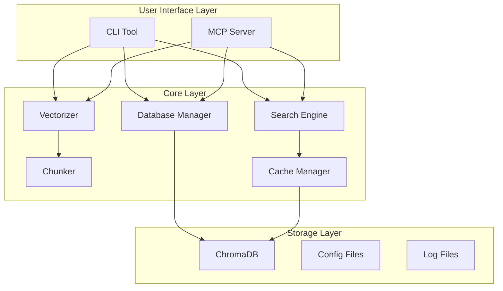

# RAGシステム アーキテクチャ仕様書

## システム概要
ローカルRAGドキュメント管理システムを、MCPサーバーとCLIツールのハイブリッド構成で実装する。

## アーキテクチャ構成



## コンポーネント設計

### 1. Core Layer（共通コア）
すべての機能の基盤となる共通ライブラリ。

#### 1.1 Database Manager (`core/database.py`)
```python
class DatabaseManager:
    """ChromaDBの操作を管理"""
    def __init__(self, path: str)
    def add_document(self, doc: Document) -> str
    def search(self, query: str, filters: Dict) -> List[SearchResult]
    def delete(self, doc_id: str) -> bool
    def update(self, doc_id: str, doc: Document) -> bool
```

#### 1.2 Vectorizer (`core/vectorizer.py`)
```python
class Vectorizer:
    """テキストのベクトル化処理"""
    def __init__(self, model_name: str)
    def vectorize(self, text: str) -> np.ndarray
    def batch_vectorize(self, texts: List[str]) -> np.ndarray
```

#### 1.3 Search Engine (`core/search.py`)
```python
class SearchEngine:
    """検索機能の実装"""
    def vector_search(self, query: str, top_k: int) -> List[Result]
    def keyword_search(self, query: str, top_k: int) -> List[Result]
    def hybrid_search(self, query: str, top_k: int) -> List[Result]
```

#### 1.4 Chunker (`core/chunker.py`)
```python
class DocumentChunker:
    """ドキュメントのチャンク分割"""
    def __init__(self, chunk_size: int, overlap: int)
    def chunk_markdown(self, content: str) -> List[Chunk]
    def chunk_html(self, content: str) -> List[Chunk]
```

### 2. CLI Interface Layer

#### 2.1 メインエントリーポイント (`cli/main.py`)
```python
@click.group()
def cli():
    """RAG Document Management System"""
    pass

@cli.command()
@click.argument('query')
@click.option('--project', '-p')
def search(query, project):
    """Search documents"""
    # 実装

@cli.command()
@click.argument('path')
@click.option('--project', '-p')
def index(path, project):
    """Index documents"""
    # 実装
```

### 3. MCP Server Layer

#### 3.1 MCPサーバー実装 (`mcp/server.py`)
```python
from mcp.server import Server, Tool, Resource

class RAGMCPServer(Server):
    """MCP Server implementation for RAG system"""
    
    async def initialize(self):
        self.db = DatabaseManager()
        self.search_engine = SearchEngine()
    
    @tool(name="rag_search")
    async def search(self, query: str, project: str = None) -> dict:
        """プロジェクトドキュメントを検索"""
        results = self.search_engine.hybrid_search(query)
        return {"results": results}
    
    @tool(name="rag_index")
    async def index(self, path: str, project: str = None) -> dict:
        """ドキュメントをインデックス"""
        # 実装
    
    @tool(name="rag_context")
    async def get_context(self, file_content: str) -> dict:
        """現在のファイルに関連するドキュメントを取得"""
        # 実装
    
    @resource(uri="rag://projects")
    async def list_projects(self) -> dict:
        """プロジェクト一覧を提供"""
        # 実装
```

## データモデル

### Document
```python
@dataclass
class Document:
    id: str
    project_id: str
    file_path: str
    content: str
    chunks: List[Chunk]
    metadata: DocumentMetadata
    created_at: datetime
    updated_at: datetime
```

### Chunk
```python
@dataclass
class Chunk:
    id: str
    document_id: str
    text: str
    vector: Optional[np.ndarray]
    position: ChunkPosition
    metadata: Dict[str, Any]
```

### SearchResult
```python
@dataclass
class SearchResult:
    chunk: Chunk
    score: float
    document: Document
    highlights: List[Highlight]
    context: Context
```

## 設定管理

### 設定ファイル構造 (`~/.rag/config.yaml`)
```yaml
# 基本設定
default_project: my_project
chroma_path: ~/.rag/chroma
log_level: INFO
log_path: ~/.rag/logs

# ベクトル化設定
embedding:
  model: sentence-transformers/multilingual-e5-base
  batch_size: 32

# チャンク設定
chunking:
  size: 1000
  overlap: 200
  separator: "\n\n"

# 検索設定
search:
  default_top_k: 5
  hybrid_alpha: 0.5  # vector vs keyword weight

# キャッシュ設定
cache:
  ttl_hours: 24
  max_size_mb: 500

# MCP設定
mcp:
  auto_index: true
  context_window: 3
```

## ファイルシステム構造

```
~/.rag/                          # ユーザーホーム配下
├── config.yaml                  # ユーザー設定
├── chroma/                      # ChromaDB永続化
│   ├── index/
│   └── metadata.db
├── logs/                        # ログファイル
│   ├── rag.log
│   └── rag.error.log
└── cache/                       # キャッシュ
    └── external_sources.db

/home/ogura/work/my-project/rag_documents/  # プロジェクトディレクトリ
├── setup.py
├── requirements.txt
├── README.md
├── rag/
│   ├── __init__.py
│   ├── __main__.py            # python -m rag
│   ├── core/                  # 共通コア
│   │   ├── __init__.py
│   │   ├── database.py
│   │   ├── vectorizer.py
│   │   ├── search.py
│   │   ├── chunker.py
│   │   └── cache_manager.py
│   ├── cli/                   # CLIインターフェース
│   │   ├── __init__.py
│   │   ├── main.py
│   │   └── commands/
│   │       ├── search.py
│   │       ├── index.py
│   │       ├── delete.py
│   │       └── sync.py
│   ├── mcp/                   # MCPサーバー
│   │   ├── __init__.py
│   │   ├── server.py
│   │   ├── handlers.py
│   │   └── resources.py
│   ├── models/                # データモデル
│   │   ├── __init__.py
│   │   ├── document.py
│   │   └── schemas.py
│   └── utils/                 # ユーティリティ
│       ├── __init__.py
│       ├── config.py
│       └── logger.py
├── tests/
│   ├── test_core/
│   ├── test_cli/
│   └── test_mcp/
└── examples/
    ├── claude_desktop_config.json
    └── hooks/
        ├── post-save.sh
        └── pre-commit.sh
```

## 依存関係

### requirements.txt
```txt
# Core
chromadb>=0.4.0
langchain>=0.1.0
sentence-transformers>=2.2.0
numpy>=1.24.0

# CLI
click>=8.1.0
rich>=13.0.0  # for beautiful CLI output
pyyaml>=6.0

# MCP Server
mcp>=0.1.0  # Model Context Protocol SDK

# Utilities
python-dotenv>=1.0.0
pydantic>=2.0.0

# Development
pytest>=7.4.0
black>=23.0.0
mypy>=1.5.0
```

## インストール方法

### 開発環境
```bash
# リポジトリクローン
git clone <repository>
cd rag_documents

# 開発モードでインストール
pip install -e .

# MCPサーバーの設定
# claude_desktop_config.json に追加
```

### 本番環境
```bash
# CLIツールのグローバルインストール
pipx install rag-system

# MCPサーバーの設定
rag mcp install  # 自動で設定ファイルを更新
```

## 使用例

### CLI使用例
```bash
# 基本的な検索
rag search "認証機能"

# プロジェクト指定検索
rag search "API" -p laravel_project

# ドキュメント登録
rag index ./docs/ --recursive

# インタラクティブモード
rag interactive
```

### MCP経由での使用（ClaudeCode内）
```
# AIが自動的に以下を実行
- 現在のコードに関連するドキュメントを検索
- 編集中のファイルに関連する設計書を参照
- 新しいドキュメントを自動インデックス
```

### claude_desktop_config.json設定例
```json
{
  "mcpServers": {
    "rag-system": {
      "command": "python",
      "args": ["-m", "rag.mcp"],
      "env": {
        "RAG_PROJECT": "my_project",
        "RAG_CONFIG_PATH": "~/.rag/config.yaml"
      }
    }
  }
}
```

## パフォーマンス最適化

### 1. ベクトル化の最適化
- バッチ処理で複数ドキュメントを同時処理
- キャッシュによる再計算の回避

### 2. 検索の最適化
- ChromaDBのインデックス最適化
- ハイブリッド検索のスコア調整

### 3. メモリ管理
- 大きなドキュメントのストリーミング処理
- チャンクサイズの動的調整